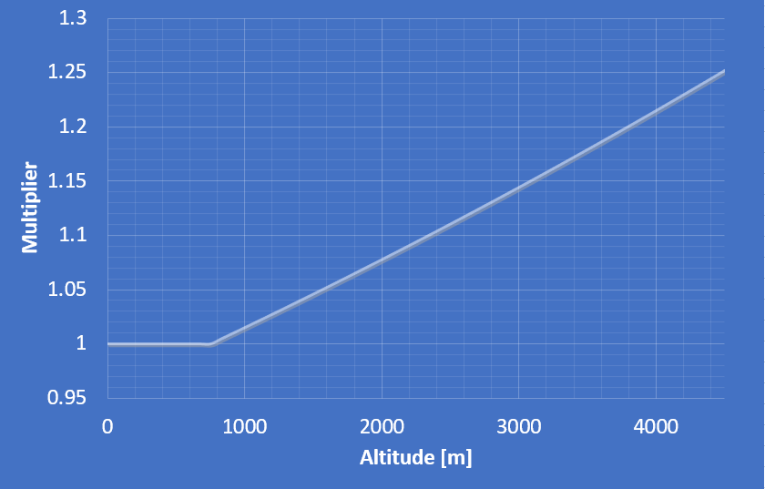
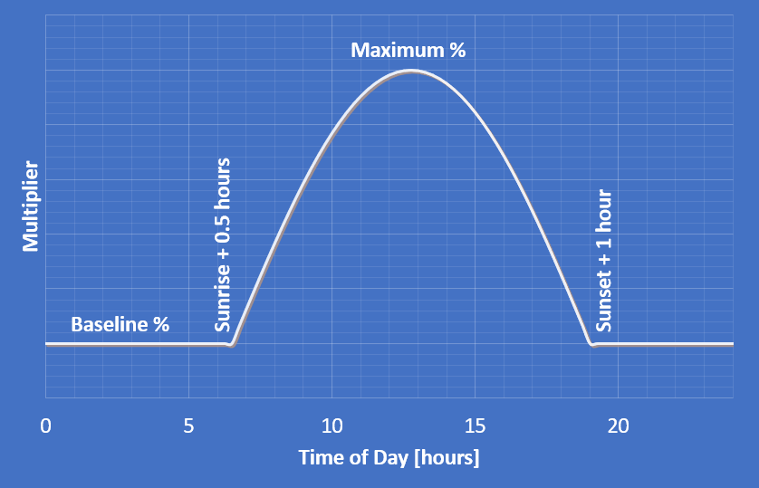

The models below are applied for pacing calculations.
- **Grade** is defined automatically by elevation data in the GPX track
- **Altitude** is defined automatically by elevation data in the GPX track
- **Terrain** is manually defined by setting Waypoint "Terrain Factors"
- **Heat** is optionally input for each Plan
- **Drift** is optionally input for each Plan
- **Darkness** is calculated based on terrain and sunrise/sunset times

##### Grade
The grade model is shown below. Upgrades are obviously take more effort than
flat terrain. Downgrades require less effort, to a crossover point at about
-16%.

##### Altitude
The altitude model is an exponentially increasing factor. The default model has
a lower threshold of 750 meters, under which altitude is assumed to be
insignificant. Above 750 meters, the time to run a given distance increases at
a rate of 6% every 1000 meters, compounded continuously.
Users can change the altitude model threshold and rate on their Settings page.

##### Terrain
The terrain model is manually input by waypoint and is based on course
knowledge. It is intended to address anything that is too small to appear in
elevation data.
Terrain factors are defined by the course owner using the "Edit" buttons within
the "Waypoints" tab.
Typical value ranges by terrain type are:
- Paved surface: 0%
- Smooth fire road: 2-4%
- Smooth singletrack: 5-10%
- Rocky singletrack: 10-20%
- Technical trail: 20%+

##### Heat
The heat model the top half of a sinusoidal curve. A "baseline" heat factor can
be applied outside of peak hours. The heat model activates 1/2 hour after
sunrise and returns to baseline 1 hour after sunset, peaking at a maximum value
as specified.
A heat model can be defined for each plan. If no heat model is defined, no heat
factor is used.

##### Darkness
From dusk to dawn, a darkness factor equal to the terrain factor is applied
(essentially doubling the terrain factor).
During twilight hours (from dawn to sunrise and sunset to dusk), the darkness
factor is linearly applied between nothing (daytime) and the full darkness
factor.

##### Pace Drift
Pace drift is linearly applied, reducing time per distance at the beginning
of the race and increasing at the end of the race.
Pace drift is defined by the user for each plan.

